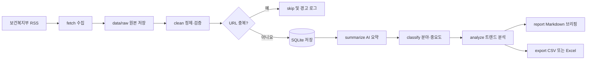

# 데이터 흐름 및 안정성 설계

## 1-11. 전체 데이터 흐름

Public Brief는 한 번에 모든 일을 처리하지 않는다. 각 단계가 자기 역할만 담당하며, 앞 단계가 저장한 결과를 다음 단계가 읽는다.



쉽게 말하면 다음 순서다.

```text
가져오기 → 원본 보관 → 정리하기 → 중복 제거 → AI 요약
→ 분야·중요도 분류 → 여러 자료 분석 → 보고서·표 파일 만들기
```

### 1단계: `fetch` — 외부 정보 수집

- 입력: 보건복지부 보도자료 RSS
- 작업: RSS 요청, XML 파싱, 수집 시각과 성공 여부 기록
- 출력: 수집 당시의 원본 데이터 파일
- 저장 위치: `data/raw/`
- 실패 시: 네트워크·HTTP 오류를 기록하고 명확한 안내 출력

### 2단계: `clean` — 정제와 중복 제거

- 입력: `data/raw/`의 원본 데이터
- 작업: 필수 필드 확인, 날짜 통일, HTML·공백 정리, URL 정규화
- 중복 판단: 정규화한 원문 URL
- 중복 정책: 이미 같은 URL이 있으면 `skip`
- 출력: 정제된 문서
- 저장 위치: SQLite `data/public_brief.db`
- 실패 시: 잘못된 자료만 제외하고 오류 기록 후 다음 자료 처리

### 3단계: `summarize` — AI 핵심 요약

- 입력: SQLite에 저장됐지만 아직 요약되지 않은 문서
- 작업: Gemini API로 핵심 내용, 업무 영향, 확인 필요 사항 생성
- 출력: 구조화된 AI 요약 결과
- 저장 위치: 해당 문서의 요약 관련 컬럼
- 실패 시: 최대 1회 재시도 후 오류 상태 저장, 다음 문서 처리

### 4단계: `classify` — 분야와 중요도 분류

- 입력: 요약 가능한 정제 문서
- 작업: 8개 업무 분야와 HIGH/MEDIUM/LOW 중요도 분류
- 출력: 분야 목록, 중요도, 중요도 판단 근거
- 저장 위치: SQLite
- 실패 시: 잘못된 값은 저장하지 않고 최대 1회 재시도

### 5단계: `analyze` — 여러 자료의 트렌드 분석

- 입력: 사용자가 지정한 기간의 분류 완료 자료
- 작업: 분야별 자료 수, 키워드 TOP N, 중요도별 분포 계산
- 출력: 기간별 분석 결과
- 실패 시: 대상 자료가 없으면 안내 후 정상 종료

### 6단계: `report` — Markdown 업무 브리핑

- 입력: 문서별 요약·분류 결과와 트렌드 분석 결과
- 작업: 핵심 이슈 TOP 3, 중요 자료, 업무 영향, 확인 사항, 오류 요약 구성
- 출력: Markdown 업무 브리핑
- 저장 위치: `data/output/weekly_brief_YYYY-MM-DD.md`
- 실패 시: 일부 문서의 AI 분석이 실패해도 성공한 문서로 리포트 생성

### 7단계: `export` — 표 파일 내보내기

- 입력: SQLite의 정제·분석 데이터
- 작업: CSV 또는 Excel 형식으로 변환
- 출력: 공유·검토용 표 파일
- 저장 위치: `data/output/`

## 단계 간 데이터 상태

문서가 현재 어디까지 처리되었는지 SQLite에 상태로 기록한다.

| 상태 | 의미 |
|---|---|
| `CLEANED` | 정제와 중복 검사를 통과함 |
| `SUMMARIZED` | AI 요약을 완료함 |
| `CLASSIFIED` | 분야와 중요도 분류를 완료함 |
| `ERROR` | 현재 단계에서 처리하지 못한 오류가 있음 |

명령어는 필요한 상태의 자료만 선택한다. 예를 들어 `summarize --unsummarized`는 `CLEANED` 상태이며 요약이 없는 자료만 처리한다.

---

## 1-12. 원본과 정제 데이터를 분리하는 이유

### 원본 데이터란?

RSS에서 받은 내용을 가급적 손대지 않고 저장한 자료다. 수집 시점의 입력을 그대로 남기는 증거 역할을 한다.

### 정제 데이터란?

프로그램이 날짜, 공백, HTML, 필수 필드, URL 등을 정리하여 검색·분석에 사용할 수 있게 만든 자료다.

### 분리해야 하는 이유

#### 1. 정제 오류를 다시 확인할 수 있음

정제 결과가 이상할 때 원본과 비교하면 어느 단계에서 내용이 잘못되었는지 찾을 수 있다.

#### 2. 정제 규칙을 바꿔 다시 처리할 수 있음

날짜 처리나 HTML 제거 규칙을 개선해도 RSS를 다시 요청하지 않고 보관한 원본으로 재실행할 수 있다.

#### 3. 원문 훼손 여부를 확인할 수 있음

AI에 전달된 내용이 실제 RSS 내용과 같은지 비교할 수 있어 사실성 검증에 도움이 된다.

#### 4. 외부 데이터 변경에 대응할 수 있음

기관이 나중에 내용을 변경하거나 피드에서 오래된 글을 제거해도 수집 당시의 자료를 확인할 수 있다.

#### 5. 역할과 보관 목적이 다름

- 원본: 추적, 재처리, 감사용
- 정제본: 검색, 중복 제거, AI 분석, 보고서 생성용

### 저장 원칙

- `fetch`는 원본만 생성하고 기존 원본을 수정하지 않는다.
- `clean`은 원본을 읽지만 원본 파일을 덮어쓰지 않는다.
- 정제 결과는 SQLite에 별도로 저장한다.
- AI 요약과 분류는 SQLite의 정제 데이터를 기준으로 수행한다.
- 리포트에는 정제 데이터와 AI 결과를 사용하되 원문 URL을 항상 포함한다.

---

## 1-13. 오류가 나도 전체가 중단되지 않는 구조

### 기본 원칙

오류는 **전체 작업 오류**와 **개별 자료 오류**로 나눈다.

- 전체 작업 오류: 계속해도 의미가 없으므로 안내 후 종료
- 개별 자료 오류: 해당 자료만 실패 처리하고 다음 자료 계속 진행

### 전체 작업을 종료하는 경우

- Gemini API 키 없이 `summarize` 또는 `classify` 실행
- SQLite를 열 수 없음
- 사용자가 잘못된 CLI 옵션이나 날짜를 입력함
- 분석 또는 리포트 대상 데이터가 전혀 없음

종료할 때는 Python 오류 화면만 보여주지 않고 사용자가 해결할 방법을 함께 출력한다.

### 다음 자료로 계속 진행하는 경우

- RSS 항목 하나의 필수 필드가 없음
- 본문이 비어 있음
- 날짜를 변환할 수 없음
- 중복 URL이 발견됨
- Gemini 요청 하나가 실패함
- AI JSON을 파싱하거나 검증할 수 없음

### 개별 자료 처리 구조

```text
전체 자료 반복 시작
  → 자료 1 처리 성공 → 저장
  → 자료 2 처리 실패 → 오류 저장 → 다음 자료
  → 자료 3 처리 성공 → 저장
전체 자료 반복 종료
  → 성공·실패·중복 건수 출력
```

각 자료를 처리하는 작은 범위에 try-except를 적용한다. 반복문 전체를 하나의 try-except로 감싸 첫 오류에서 모든 작업이 끝나는 구조는 피한다.

### 오류 기록 형식

오류는 SQLite의 별도 오류 테이블과 로그에 기록한다.

```json
{
  "step": "summarize",
  "item_id": 42,
  "type": "JSON_PARSE_ERROR",
  "message": "Gemini response is not valid JSON"
}
```

기본 오류 필드는 다음과 같다.

- 오류가 발생한 단계 `step`
- 관련 자료 ID `item_id`
- 오류 종류 `type`
- 사용자가 이해할 수 있는 설명 `message`
- 발생 시각
- 재시도 횟수

### 재시도 원칙

- 네트워크 또는 Gemini API의 일시적 오류만 재시도한다.
- 외부 RSS 요청은 최대 1회 재시도한다.
- 잘못된 AI 응답은 최대 1회 재요청한다.
- 필수 필드 누락처럼 재시도로 해결되지 않는 오류는 즉시 실패 처리한다.
- 모든 재시도에는 timeout을 적용한다.
- 무한 재시도는 구현하지 않는다.

### 중간 결과 보존

- 자료 하나가 성공할 때마다 SQLite에 저장을 확정한다.
- 뒤의 자료가 실패해도 앞에서 성공한 결과를 취소하지 않는다.
- 실패한 자료에는 오류 상태를 남겨 나중에 다시 찾을 수 있게 한다.
- 재실행할 때 완료된 자료는 건너뛰고 미완료·실패 자료만 선택할 수 있게 한다.

### 실행 종료 요약

각 명령이 끝나면 다음과 같이 결과를 보여준다.

```text
[INFO] 처리 대상: 20건
[INFO] 성공: 17건
[WARNING] 중복 스킵: 2건
[ERROR] 실패: 1건
```

이 구조를 사용하면 일부 데이터나 AI 요청이 실패해도 처리 가능한 자료로 브리핑을 계속 만들 수 있다.

